# Prod Copilot -- Архитектура системы

> Универсальный AI-копилот для работы с API: загружает Swagger/OpenAPI спецификации,
> индексирует эндпоинты с помощью векторных эмбеддингов, и выполняет произвольные
> запросы на естественном языке через LLM-оркестратор.

---

## Содержание

1. [Общая архитектура системы](#1-общая-архитектура-системы)
2. [Поток обработки запроса (Request Flow)](#2-поток-обработки-запроса-request-flow)
3. [Архитектура Backend сервиса](#3-архитектура-backend-сервиса)
4. [Архитектура MLOps сервиса](#4-архитектура-mlops-сервиса)
5. [Система планирования и выполнения](#5-система-планирования-и-выполнения)
6. [Типы результатов](#6-типы-результатов)
7. [Конфигурация LLM провайдеров](#7-конфигурация-llm-провайдеров)
8. [Docker архитектура](#8-docker-архитектура)
9. [API Reference (краткий)](#9-api-reference-краткий)

---

## 1. Общая архитектура системы

Система состоит из пяти сервисов, развернутых в Docker Compose. Frontend общается
с Backend по WebSocket, Backend стримит данные из MLOps через SSE (Server-Sent Events),
MLOps обращается к внешним LLM-провайдерам через OpenAI-совместимый API, а к внешним
API -- по HTTP. Все метаданные и векторные эмбеддинги хранятся в PostgreSQL с
расширением pgvector.

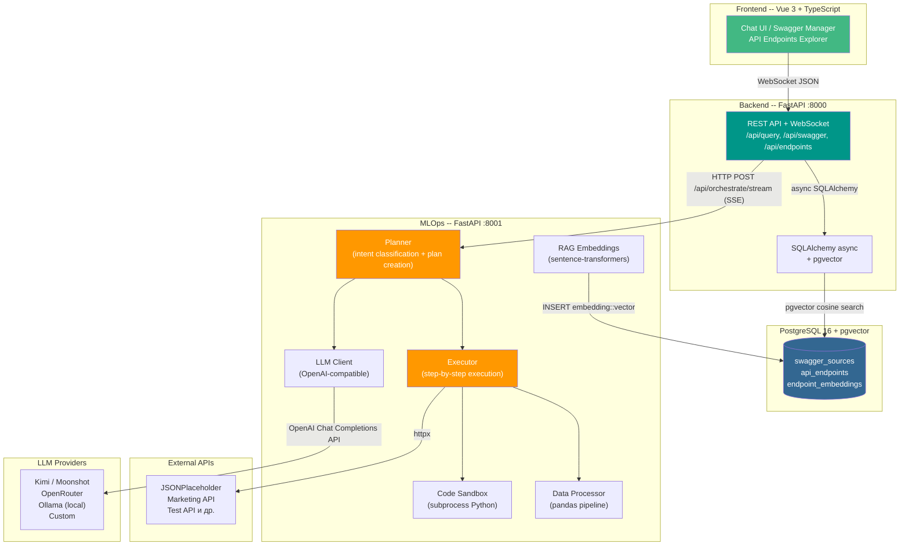

### Протоколы взаимодействия

| Связь | Протокол | Описание |
|-------|----------|----------|
| Frontend -> Backend | **WebSocket** | Двунаправленный канал. Клиент отправляет `{query, swagger_source_ids, history}`, сервер стримит `step`, `result`, `done` сообщения |
| Backend -> MLOps | **HTTP + SSE** | `POST /api/orchestrate/stream` -- Backend подключается как SSE-клиент, MLOps стримит события `plan`, `step_start`, `step_complete`, `step_error`, `result` |
| Backend -> PostgreSQL | **SQL (asyncpg)** | Асинхронные запросы через SQLAlchemy 2.0 async engine |
| MLOps -> PostgreSQL | **SQL (asyncpg)** | Отдельный engine для RAG-индексации и поиска эмбеддингов |
| MLOps -> LLM | **OpenAI-compatible API** | Через библиотеку `openai` (AsyncOpenAI client) |
| MLOps -> External APIs | **HTTP (httpx)** | Выполнение API-вызовов по плану из LLM |

---

## 2. Поток обработки запроса (Request Flow)

### 2.1 Основной поток (Plan-Execute)

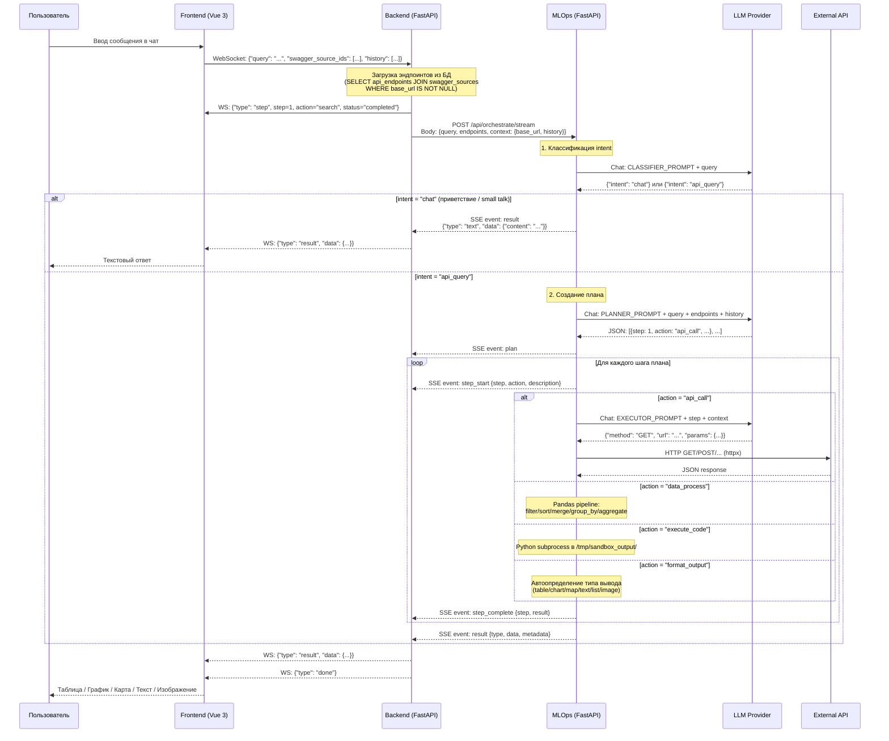

### 2.2 Альтернативный поток (Agent Loop)

При установке `ORCHESTRATION_MODE=agent` MLOps использует tool-calling интерфейс LLM
вместо фиксированного плана. LLM сам решает, какие инструменты вызывать и в каком
порядке.

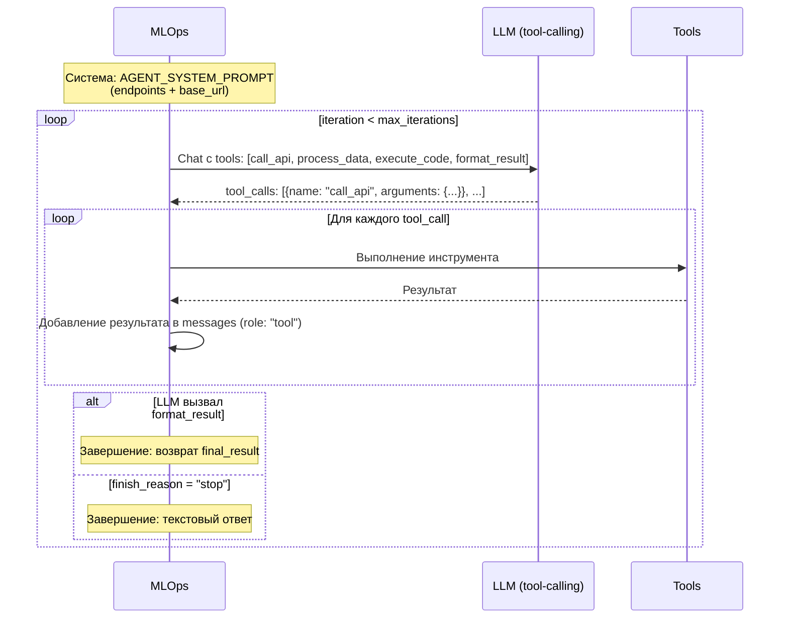

### 2.3 Быстрый путь (Fast Path)

Для тривиальных приветствий (`hi`, `hello`, `hey`) система не обращается к LLM --
возвращает мгновенный ответ из словаря `_INSTANT_GREETINGS`.

---

## 3. Архитектура Backend сервиса

Backend -- FastAPI-приложение, которое служит API-шлюзом между Frontend и MLOps,
а также управляет хранением Swagger-спецификаций и эндпоинтов в PostgreSQL.

### 3.1 Структура каталогов

```
backend/
  app/
    main.py              # FastAPI app, lifespan, CORS, pgvector extension
    config.py            # Settings (pydantic-settings)
    api/
      router.py          # Корневой роутер: /api/swagger, /api/endpoints, /api/query
      query.py           # POST /query + WebSocket /ws/query
      swagger.py         # Загрузка, парсинг, индексация Swagger-спецификаций
      endpoints.py       # CRUD и поиск по эндпоинтам
    services/
      mlops_client.py    # HTTP-клиент к MLOps (orchestrate, translate, stream)
      rag_service.py     # pgvector семантический поиск
      swagger_parser.py  # Парсер OpenAPI 3.x и Swagger 2.0
    db/
      models.py          # SQLAlchemy ORM модели
      session.py         # Async engine + session factory
    schemas/
      models.py          # Pydantic модели запросов/ответов
```

### 3.2 Жизненный цикл приложения (Lifespan)

При старте `main.py` выполняет:

1. Создание расширения `vector` в PostgreSQL: `CREATE EXTENSION IF NOT EXISTS vector`
2. Создание всех таблиц через `Base.metadata.create_all`
3. Миграция: `ALTER TABLE swagger_sources ADD COLUMN IF NOT EXISTS base_url`
4. При завершении -- `engine.dispose()`

### 3.3 API-модуль

#### query.py -- Обработка пользовательских запросов

| Endpoint | Тип | Описание |
|----------|-----|----------|
| `POST /api/query` | REST | Синхронная оркестрация. Загружает эндпоинты из БД, пересылает в MLOps |
| `WS /api/ws/query` | WebSocket | Потоковая оркестрация. SSE-стриминг из MLOps преобразуется в WS-сообщения |

Протокол WebSocket:

```
Client -> Server: {"query": "...", "swagger_source_ids": [1, 2], "history": [...]}
Server -> Client: {"type": "step", "data": {step, action, description, status, result}}
Server -> Client: {"type": "result", "data": {type, data, metadata}}
Server -> Client: {"type": "done", "data": {}}
Server -> Client: {"type": "error", "data": {"message": "..."}}
```

Логика обработки:
1. Получение сообщения по WebSocket
2. `SELECT api_endpoints JOIN swagger_sources WHERE base_url IS NOT NULL`
   (с опциональной фильтрацией по `swagger_source_ids`)
3. Формирование `endpoints_payload` (id, method, path, summary, description, parameters, request_body, response_schema)
4. Определение `base_url` из первого SwaggerSource с непустым base_url
5. Отправка шага `search` клиенту
6. Стриминг через `mlops_client.orchestrate_stream()` -- SSE-события преобразуются в WS-сообщения
7. Отправка `done` сигнала

#### swagger.py -- Управление Swagger-спецификациями

| Endpoint | Метод | Описание |
|----------|-------|----------|
| `/api/swagger/upload` | POST | Загрузка спецификации (файл JSON/YAML или URL) |
| `/api/swagger/list` | GET | Список всех загруженных источников |
| `/api/swagger/{source_id}/endpoints` | GET | Эндпоинты конкретного источника |
| `/api/swagger/{source_id}/stats` | GET | Статистика по методам |
| `/api/swagger/{source_id}` | DELETE | Удаление источника и его эндпоинтов (каскадное) |

Процесс загрузки:
1. Получение контента (файл или URL через httpx)
2. Парсинг JSON или YAML
3. `SwaggerParser.parse()` -- извлечение эндпоинтов
4. `SwaggerParser.extract_base_url()` -- извлечение базового URL из спецификации
5. Сохранение `SwaggerSource` в БД
6. `RAGService.index_endpoints()` -- генерация эмбеддингов и сохранение `ApiEndpoint` записей

#### endpoints.py -- Управление эндпоинтами

| Endpoint | Метод | Описание |
|----------|-------|----------|
| `/api/endpoints/list` | GET | Список с фильтрацией (source, method, path, search, tag, has_parameters, has_request_body) |
| `/api/endpoints/stats` | GET | Общая статистика (total, by_method, by_source) |
| `/api/endpoints/methods` | GET | Уникальные HTTP-методы |
| `/api/endpoints/paths` | GET | Все пути с методом и summary |
| `/api/endpoints/search` | GET | Семантический поиск (pgvector cosine similarity) |
| `/api/endpoints/{id}` | GET | Детали одного эндпоинта |

### 3.4 Сервисный слой

#### MLOpsClient (`services/mlops_client.py`)

Асинхронный HTTP-клиент для связи с MLOps-сервисом. Timeout: 120 секунд (connect: 10 секунд).

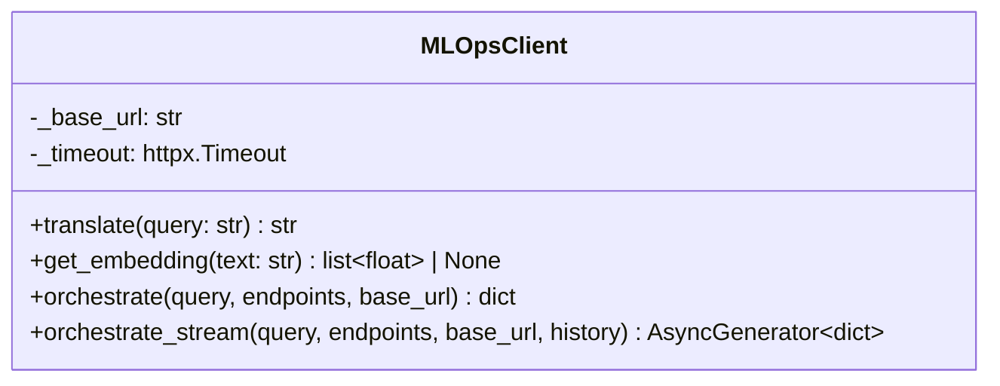

Метод `orchestrate_stream` парсит SSE-формат (строки `event:` и `data:`), добавляет поле `event_type` к каждому событию и отдает их через `yield`.

#### RAGService (`services/rag_service.py`)

Управляет индексацией и семантическим поиском эндпоинтов через pgvector.

- **index_endpoints()**: для каждого `ParsedEndpoint` формирует текст для эмбеддинга
  (метод + путь + summary + description + параметры), запрашивает вектор через MLOps,
  сохраняет `ApiEndpoint` с полем `embedding Vector(384)`
- **search()**: получает эмбеддинг запроса через MLOps, выполняет SQL-запрос с оператором
  `<=>` (cosine distance) по pgvector

#### SwaggerParser (`services/swagger_parser.py`)

Поддерживает два формата спецификаций:

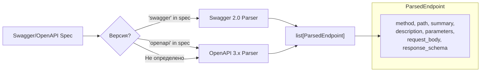

Особенности парсинга:
- Swagger 2.0: body-параметры из `parameters` с `in: body` извлекаются как `request_body`
- OpenAPI 3.x: `requestBody.content.application/json.schema` -> `request_body`
- `basePath` (Swagger 2.0) и `servers[0].url` (OpenAPI 3.x) учитываются в путях
- `extract_base_url()`: для OpenAPI 3.x берет `servers[0].url`, для Swagger 2.0 -- `{scheme}://{host}{basePath}`
- Параметры мержатся: path-level + operation-level (операция переопределяет)

### 3.5 Модели базы данных

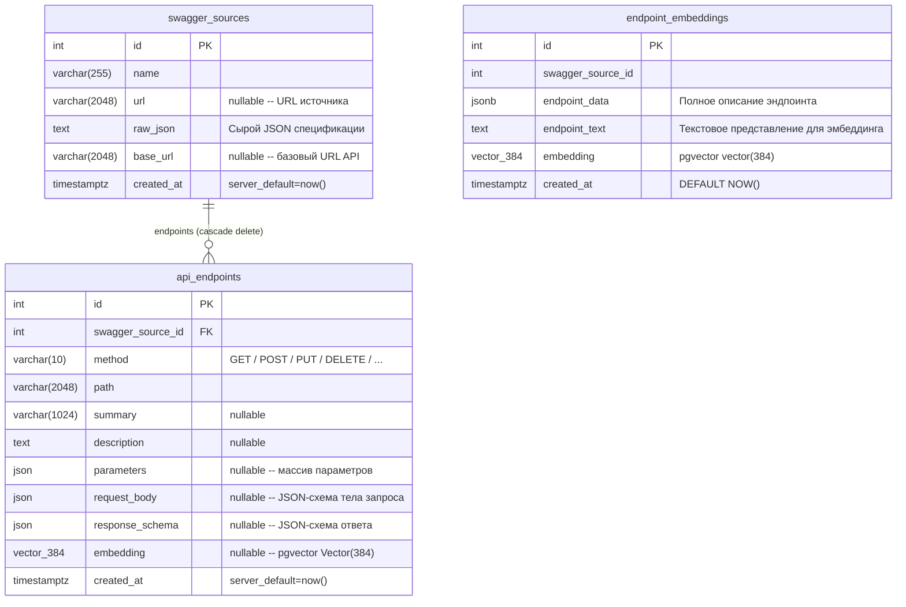

**Примечание**: Таблица `endpoint_embeddings` используется MLOps-сервисом (модуль `mlops/app/rag/search.py`)
для собственного RAG-индекса, а поле `embedding` в `api_endpoints` заполняется Backend-сервисом
через `RAGService`. Обе системы используют одну и ту же размерность 384 (модель `all-MiniLM-L6-v2`).

### 3.6 Сессии и подключение к БД

```python
# session.py -- ключевые параметры
engine = create_async_engine(
    database_url,          # postgresql+asyncpg://...
    pool_size=20,          # Максимум постоянных соединений
    max_overflow=10,       # Дополнительные соединения сверх пула
    pool_pre_ping=True,    # Проверка соединения перед использованием
)
```

Сессии управляются через FastAPI Depends (`get_db()`): auto-commit при успехе,
rollback при исключении.

### 3.7 Pydantic-схемы (Backend)

| Схема | Ключевые поля | Назначение |
|-------|--------------|-----------|
| `QueryRequest` | `query: str`, `swagger_source_ids: list[int] | None` | Входной запрос |
| `ResultResponse` | `type: Literal[text,list,table,map,chart,image,dashboard]`, `data: dict`, `metadata: dict | None` | Результат оркестрации |
| `OrchestrationStep` | `step: int`, `action: str`, `description: str`, `status: Literal`, `result: dict | None` | Шаг выполнения |
| `SwaggerSourceResponse` | `id, name, url, base_url, created_at` | Информация об источнике |
| `SwaggerUploadResponse` | `id, name, base_url, endpoints_count, message` | Результат загрузки |
| `EndpointSearchResult` | `id, swagger_source_id, method, path, summary, description, parameters, request_body, response_schema` | Эндпоинт |

### 3.8 Конфигурация Backend (`config.py`)

| Переменная | Тип | По умолчанию | Описание |
|-----------|-----|-------------|----------|
| `POSTGRES_USER` | str | `postgres` | Имя пользователя PostgreSQL |
| `POSTGRES_PASSWORD` | str | `postgres` | Пароль |
| `POSTGRES_DB` | str | `prod_copilot` | Имя базы данных |
| `POSTGRES_HOST` | str | `localhost` | Хост (в Docker -- `postgres`) |
| `POSTGRES_PORT` | int | `5432` | Порт |
| `MOCK_MODE` | bool | `false` | Режим без реального LLM |
| `MLOPS_BASE_URL` | str | `http://mlops:8001` | URL MLOps-сервиса |

---

## 4. Архитектура MLOps сервиса

MLOps -- FastAPI-приложение, отвечающее за:
- LLM-оркестрацию (планирование и выполнение запросов)
- RAG-индексацию и семантический поиск эмбеддингов
- Выполнение HTTP-вызовов к внешним API
- Обработку данных через pandas-пайплайны
- Исполнение Python-кода в изолированном sandbox

### 4.1 Структура каталогов

```
mlops/
  app/
    main.py              # FastAPI app, lifespan, все эндпоинты
    config.py            # Settings с провайдер-пресетами LLM
    llm/
      kimi_client.py     # LLMClient (OpenAI-compatible) + retry + JSON parsing
      prompts.py         # Системные промпты: CLASSIFIER, TRANSLATE, PLANNER, EXECUTOR
      mock_client.py     # MockKimiClient для разработки без LLM
    orchestrator/
      planner.py         # Классификация intent + создание плана
      executor.py        # Последовательное выполнение шагов плана
      agent_loop.py      # Альтернативный режим: LLM tool-calling agent
    mcp/
      api_executor.py    # HTTP-вызовы к внешним API (httpx)
      data_processor.py  # Pandas-обработка данных (filter, sort, merge, ...)
      code_sandbox.py    # Python-код в subprocess
    rag/
      embeddings.py      # sentence-transformers + mock embeddings
      search.py          # pgvector cosine search + HNSW index
    schemas/
      models.py          # Pydantic-модели MLOps
```

### 4.2 Жизненный цикл MLOps (Lifespan)

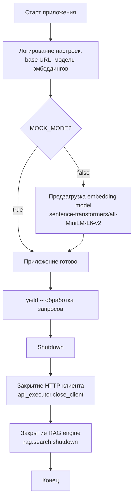

### 4.3 LLM Client (`llm/kimi_client.py`)

Клиент для любого OpenAI-совместимого LLM API, реализованный через `openai.AsyncOpenAI`.

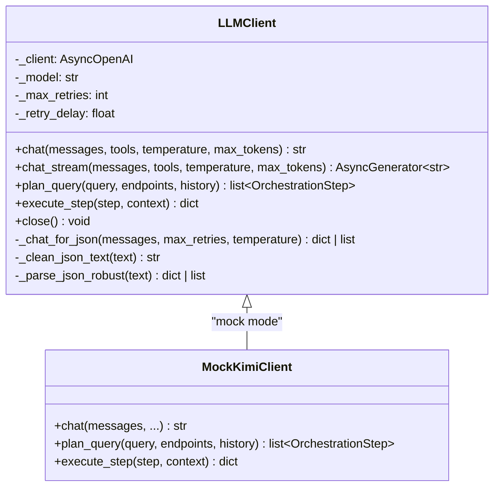

#### Механизм retry

Используется библиотека `tenacity` для повторных попыток при:
- `RateLimitError` -- превышение лимита запросов
- `APIConnectionError` -- ошибка подключения
- `APITimeoutError` -- таймаут

Параметры: экспоненциальная задержка (multiplier от настроек, min=1s, max=30s),
макс. количество попыток из `LLM_MAX_RETRIES`.

#### Поддержка thinking-моделей

Для моделей с reasoning (Kimi K2.5, DeepSeek и др.) ответ может приходить в поле
`reasoning` вместо `content`. Клиент последовательно пытается:

1. Найти JSON-массив с ключами `step` или `action`
2. Найти JSON-объект с кавычечными ключами
3. Извлечь последнюю закавыченную строку (для translate)
4. Взять последнюю короткую непустую строку

#### JSON retry loop (`_chat_for_json`)

Если LLM возвращает невалидный JSON, метод добавляет в messages:
`"Invalid JSON. Return ONLY valid JSON."` и повторяет запрос (до 3 раз).

Robust JSON parsing (`_parse_json_robust`) обрабатывает:
1. Прямой `json.loads`
2. Склейка фрагментов: `[{a}]\n[{b}]` -> `[{a},{b}]` через `_merge_json_fragments`
3. Оборачивание в массив: `{a},{b}` -> `[{a},{b}]`

### 4.4 Системные промпты (`llm/prompts.py`)

| Промпт | Назначение | Формат ответа |
|--------|-----------|---------------|
| `CLASSIFIER_PROMPT` | Определение intent: chat vs api_query | `{"intent": "chat", "response": "..."}` или `{"intent": "api_query"}` |
| `TRANSLATE_PROMPT` | Перевод запроса на английский для RAG | Только текст перевода |
| `PLANNER_PROMPT` | Создание плана выполнения | JSON-массив шагов `[{step, action, description, endpoint, parameters}]` |
| `EXECUTOR_PROMPT` | Инструкции для выполнения одного шага | JSON с параметрами для конкретного действия |
| `DATA_PROCESSOR_PROMPT` | (резервный) Определение pandas-операций | JSON-массив операций |

**Ключевые правила PLANNER_PROMPT:**

1. Последний шаг ОБЯЗАТЕЛЬНО `format_output`
2. `data_process` предпочтительнее `execute_code` для простых операций
3. `execute_code` НЕ может импортировать `requests/urllib/http` -- все HTTP-вызовы через `api_call`
4. В `execute_code` данные доступны как `data` (последний шаг) и `step_results` (словарь всех шагов)
5. Все нужные данные загружаются через `api_call` ПЕРЕД обработкой

### 4.5 Оркестратор: Planner (`orchestrator/planner.py`)

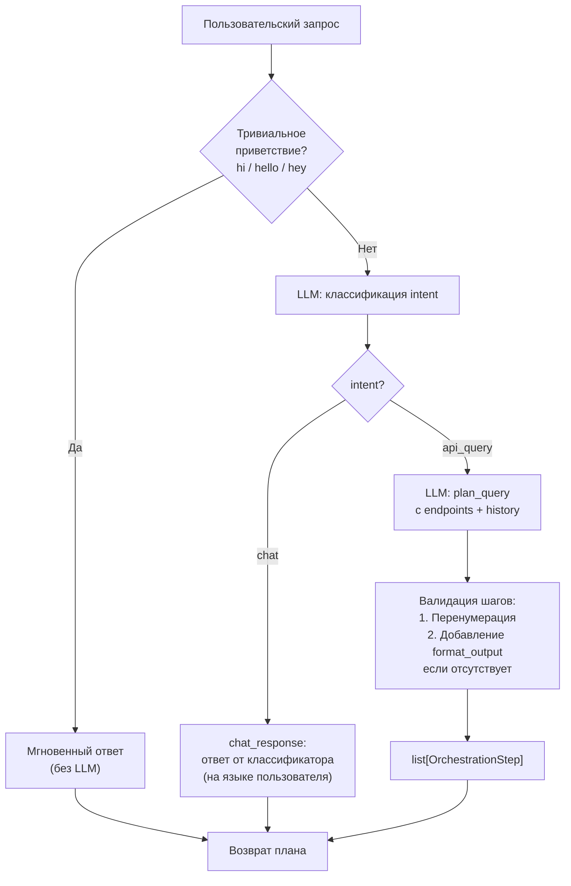

#### Контекст чата (history)

Planner передает последние 6 сообщений из истории чата в LLM для поддержания
контекста разговора. Это позволяет использовать ссылки типа "покажи эти посты
в виде графика".

### 4.6 Оркестратор: Executor (`orchestrator/executor.py`)

Executor выполняет план последовательно, шаг за шагом, накапливая контекст
(`step_results`) для передачи между шагами.

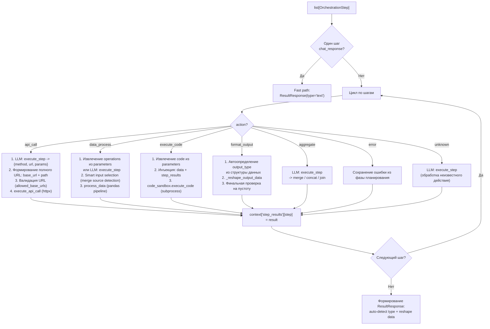

**Timeout**: каждый шаг ограничен 120 секундами (`_STEP_TIMEOUT`). При таймауте
`format_output` использует fallback с автоопределением типа вывода.

#### Контекст между шагами

```python
context = {
    "base_url": "https://api.example.com",
    "history": [...],           # Chat history
    "step_results": {
        "1": {                  # Результат api_call
            "status_code": 200,
            "success": True,
            "body": [...],
            "elapsed_ms": 45.2
        },
        "2": {                  # Результат data_process
            "data": [...],
            "columns": [...],
            "row_count": 50
        },
        "3": {                  # Результат format_output
            "output_type": "table",
            "data": {"columns": [...], "rows": [...]},
            "config": {}
        }
    }
}
```

Функция `_truncate_for_llm` ограничивает размер контекста до 50000 символов
(делит лимит поровну между шагами), чтобы не превысить контекстное окно LLM.

### 4.7 Agent Loop (`orchestrator/agent_loop.py`)

Альтернативный режим оркестрации, когда LLM сам управляет потоком через tool-calling API.

**Доступные инструменты:**

| Инструмент | Описание | Ключевые параметры |
|-----------|----------|-------------------|
| `call_api` | HTTP-запрос к API | method, url, params, headers, body |
| `process_data` | Pandas-обработка | data, operations |
| `execute_code` | Python sandbox | code, timeout |
| `format_result` | Финальное форматирование | output_type, data, summary |

Завершение: LLM вызывает `format_result` или отвечает текстом (`finish_reason=stop`).
Лимит итераций: `ORCHESTRATION_MAX_ITERATIONS` (по умолчанию 0 = неограниченно, safety cap = 100).

### 4.8 MCP-модули

#### API Executor (`mcp/api_executor.py`)

Выполняет HTTP-запросы к внешним API через переиспользуемый `httpx.AsyncClient`.

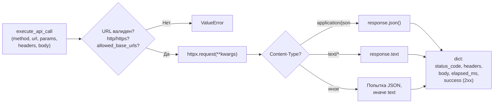

Параметры клиента:
- Timeout: 30 секунд (connect: 10 секунд)
- Follow redirects: включено
- SSL verify: отключено (для Docker-окружения)
- Max connections: 100, keepalive: 20
- Max response size: 10 MB

Безопасность: `allowed_base_urls` -- список разрешенных URL-префиксов.
URL, не начинающийся ни с одного из них, отклоняется. Это блокирует
URL, галлюцинированные LLM.

#### Data Processor (`mcp/data_processor.py`)

Pandas-пайплайн для обработки данных. Все данные конвертируются в `pd.DataFrame`
через универсальный `_to_dataframe()`.

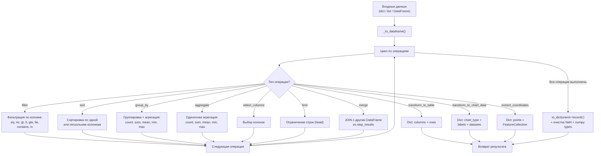

**Smart Merge**: при операции `merge` система:
1. Ищет указанный `source` в `step_results`
2. Если не найден -- автосканирует все `step_results`, ищет DataFrame с колонкой `right_on`
3. Предпочитает источники, привносящие новые колонки (чтобы не джоинить таблицу саму с собой)
4. Если `left_on` не найдена -- пытается автоопределить (паттерн: `userId` -> `id`)

Поддерживаемые форматы входных данных для `_to_dataframe()`:
- `{"columns": [...], "rows": [...]}` -- табличный формат
- `{"col1": [...], "col2": [...]}` -- колоночный формат
- `{"items": [...]}`, `{"results": [...]}`, `{"data": [...]}`, `{"body": [...]}` -- обертки
- `[{...}, {...}]` -- список записей
- `[value1, value2]` -- список скаляров
- Одиночный dict -- одна строка

#### Code Sandbox (`mcp/code_sandbox.py`)

Выполняет произвольный Python-код в subprocess с ограничениями.

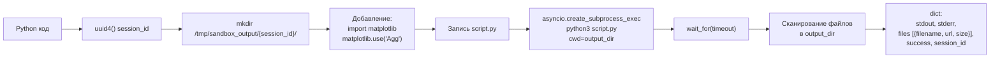

Ограничения:
- Max timeout: 60 секунд (настраиваемый, по умолчанию 30)
- stdout: truncated до 50 KB
- stderr: truncated до 10 KB
- Доступные библиотеки: pandas, numpy, matplotlib, plotly
- Файлы отдаются через `/api/sandbox/files/{session_id}/{filename}`

При вызове из Executor'а код получает инъецированные переменные:
- `data` -- результат последнего шага (body/items)
- `step_results` -- словарь всех шагов (ключи -- строковые номера шагов)

### 4.9 RAG-модули

#### Embeddings (`rag/embeddings.py`)

- **Модель**: `sentence-transformers/all-MiniLM-L6-v2` (384 измерения)
- **Загрузка**: lazy, thread-safe singleton через `threading.Lock`
- **Батчинг**: `batch_size=32`, `normalize_embeddings=True`
- **Mock mode**: детерминированный псевдослучайный вектор из SHA-512 хеша текста

#### Search (`rag/search.py`)

Таблица `endpoint_embeddings` с HNSW-индексом для быстрого косинусного поиска.

```sql
-- Создание таблицы
CREATE TABLE IF NOT EXISTS endpoint_embeddings (
    id SERIAL PRIMARY KEY,
    swagger_source_id INTEGER NOT NULL,
    endpoint_data JSONB NOT NULL,
    endpoint_text TEXT NOT NULL,
    embedding vector(384) NOT NULL,
    created_at TIMESTAMP WITH TIME ZONE DEFAULT NOW()
);

-- HNSW индекс для косинусного расстояния
CREATE INDEX IF NOT EXISTS idx_endpoint_embeddings_cosine
ON endpoint_embeddings USING hnsw (embedding vector_cosine_ops);

-- Индекс для фильтрации по источнику
CREATE INDEX IF NOT EXISTS idx_endpoint_embeddings_source_id
ON endpoint_embeddings (swagger_source_id);
```

**Поиск**: `1 - (embedding <=> query_embedding::vector)` -- возвращает similarity score (0..1).

**Индексация**: при повторной индексации одного `swagger_source_id` старые записи удаляются
(upsert-поведение).

### 4.10 Pydantic-схемы (MLOps)

```mermaid
classDiagram
    class OrchestrationRequest {
        +str query
        +list~dict~ endpoints
        +dict | None context
    }

    class OrchestrationStep {
        +int step
        +str action
        +str description
        +dict | None endpoint
        +dict | None parameters
        +Literal status
        +dict | None result
        +str | None error
        +coerce_result_to_dict() validator
    }

    class ResultResponse {
        +Literal type
        +dict data
        +dict | None metadata
    }

    class OrchestrationStreamEvent {
        +Literal event
        +dict data
    }

    class EmbeddingRequest {
        +list~str~ texts
    }

    class EmbeddingResponse {
        +list~list~float~~ embeddings
    }

    class SearchRequest {
        +str query
        +list~int~ | None swagger_source_ids
        +int limit
    }

    class SearchResponse {
        +list~SearchResult~ results
    }

    class SearchResult {
        +dict endpoint
        +float score
    }

    OrchestrationRequest --> OrchestrationStep : "plan"
    OrchestrationStep --> ResultResponse : "execution"
    OrchestrationStreamEvent --> ResultResponse : "event: result"
```

Валидатор `coerce_result_to_dict` в `OrchestrationStep` гарантирует, что `result`
всегда `dict | None`: списки оборачиваются в `{"items": [...]}`, скаляры в `{"content": str(v)}`.

---

## 5. Система планирования и выполнения

### 5.1 Структура плана

План -- это JSON-массив шагов, каждый из которых содержит:

```json
{
    "step": 1,
    "action": "api_call | data_process | execute_code | format_output",
    "description": "Человекочитаемое описание шага",
    "endpoint": {"method": "GET", "path": "/posts"},
    "parameters": {"operations": [...], "code": "...", "output_type": "table"}
}
```

### 5.2 Типы действий (Actions)

```mermaid
flowchart TB
    subgraph "api_call -- HTTP-запрос к API"
        AC_IN["endpoint + parameters"] --> AC_LLM["LLM: формирование<br/>method + url + params"]
        AC_LLM --> AC_EXEC["api_executor.execute_api_call"]
        AC_EXEC --> AC_OUT["status_code + body + elapsed_ms"]
    end

    subgraph "data_process -- Pandas-обработка"
        DP_IN["operations (из planner)"] --> DP_INPUT["Автовыбор входных данных<br/>из step_results"]
        DP_INPUT --> DP_EXEC["data_processor.process_data"]
        DP_EXEC --> DP_OUT["data + columns + row_count"]
    end

    subgraph "execute_code -- Python Sandbox"
        EC_IN["code (из planner)"] --> EC_INJECT["Инъекция: data + step_results"]
        EC_INJECT --> EC_EXEC["code_sandbox.execute_code"]
        EC_EXEC --> EC_OUT["stdout (JSON) / files (images)"]
    end

    subgraph "format_output -- Форматирование"
        FO_IN["output_type hint"] --> FO_AUTO["Автоопределение типа<br/>из структуры данных"]
        FO_AUTO --> FO_RESHAPE["_reshape_output_data"]
        FO_RESHAPE --> FO_OUT["output_type + data + config"]
    end
```

### 5.3 data_process -- Операции

| Операция | Параметры | Пример |
|----------|-----------|--------|
| `filter` | column, operator, value | `{"type": "filter", "column": "name", "operator": "contains", "value": "k"}` |
| `sort` | column (str или list), ascending | `{"type": "sort", "column": "id", "ascending": true}` |
| `group_by` | columns, aggregations | `{"type": "group_by", "columns": ["userId"], "aggregations": {"body": "count"}}` |
| `aggregate` | function, column | `{"type": "aggregate", "function": "sum", "column": "val"}` |
| `select_columns` | columns | `{"type": "select_columns", "columns": ["id", "name"]}` |
| `limit` | n | `{"type": "limit", "n": 10}` |
| `merge` | source, left_on, right_on, how | `{"type": "merge", "source": "2", "left_on": "userId", "right_on": "id", "how": "inner"}` |
| `transform_to_table` | columns (optional) | `{"type": "transform_to_table"}` |
| `transform_to_chart_data` | x, y, chart_type | `{"type": "transform_to_chart_data", "x": "name", "y": "value", "chart_type": "bar"}` |
| `extract_coordinates` | lat_column, lng_column, label_column | `{"type": "extract_coordinates", "lat_column": "lat", "lng_column": "lng"}` |

Операторы фильтрации: `eq`, `ne`, `gt`, `lt`, `gte`, `lte`, `contains`, `in`.

### 5.4 Поток данных между шагами

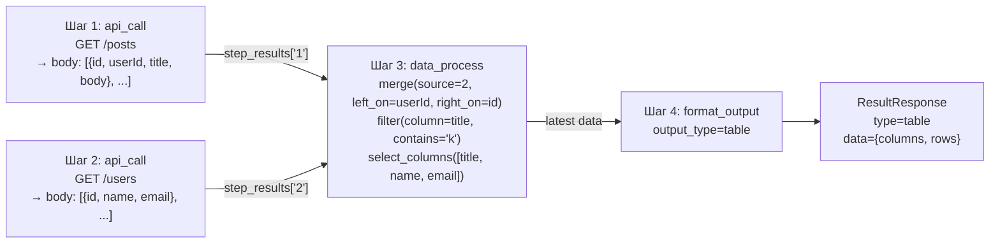

`_get_latest_data()` извлекает результат из шага с максимальным номером. Для `api_call`
результатов извлекается `body` (при `success=true`). При ошибке API возвращается `{"error": "..."}`.

### 5.5 Автоопределение типа вывода

Executor анализирует структуру последнего результата и определяет `output_type`:

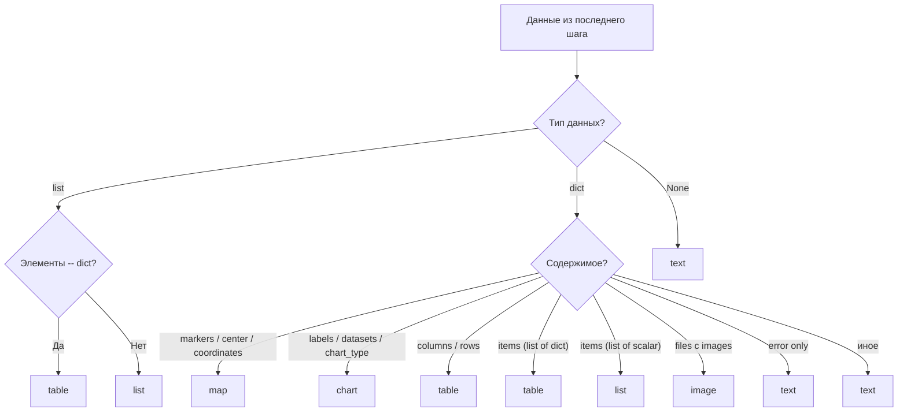

### 5.6 Стриминговый режим (`execute_plan_stream`)

В стриминговом режиме Executor генерирует `OrchestrationStreamEvent` для каждого этапа:

| Событие | Когда | Содержание |
|---------|-------|-----------|
| `plan` | После создания плана | `{steps: [...], total: N}` |
| `step_start` | Перед выполнением шага | `{step, action, description}` |
| `step_complete` | После успешного выполнения | `{step, action, description, result}` |
| `step_error` | При ошибке шага | `{step, action, description, error, result}` |
| `result` | Финальный результат | `{type, data, metadata}` |

---

## 6. Типы результатов

Система поддерживает 7 типов результатов, каждый с определенной структурой данных.
Frontend отображает их соответствующими компонентами.

### 6.1 text

Простой текстовый ответ, рендерится как Markdown.

```json
{
    "type": "text",
    "data": {
        "content": "Markdown-текст ответа..."
    }
}
```

### 6.2 table

Табличные данные с сортировкой и фильтрацией на клиенте.

```json
{
    "type": "table",
    "data": {
        "columns": ["id", "name", "email", "phone"],
        "rows": [
            {"id": 1, "name": "Leanne", "email": "l@example.com", "phone": "1-770-736-8031"},
            {"id": 2, "name": "Ervin", "email": "e@example.com", "phone": "010-692-6593"}
        ]
    }
}
```

Метод `_reshape_output_data("table", data)` умеет извлекать записи из различных оберток:
`data.data`, `data.items`, `data.body`. Для одиночного dict оборачивает в массив.

### 6.3 chart

Интерактивные графики через ECharts.

```json
{
    "type": "chart",
    "data": {
        "chart_type": "bar",
        "labels": ["Jan", "Feb", "Mar"],
        "datasets": [
            {"label": "Sales", "data": [100, 200, 150]}
        ]
    }
}
```

Поддерживаемые chart_type: `bar`, `line`, `pie`, `scatter`, `radar`.
При наличии поля `option` передается напрямую в ECharts (`setOption`).

### 6.4 map

Карта с маркерами через Leaflet.

```json
{
    "type": "map",
    "data": {
        "center": [55.7558, 37.6173],
        "zoom": 10,
        "markers": [
            {"lat": 55.7558, "lng": 37.6173, "label": "Москва"},
            {"lat": 59.9343, "lng": 30.3351, "label": "Санкт-Петербург"}
        ]
    }
}
```

Автоцентрирование: при наличии маркеров, но отсутствии `center` --
вычисляется среднее lat/lng.

### 6.5 list

Список элементов.

```json
{
    "type": "list",
    "data": {
        "items": ["Item 1", "Item 2", "Item 3"]
    }
}
```

### 6.6 image

Изображения, сгенерированные code sandbox (matplotlib, plotly и др.).

```json
{
    "type": "image",
    "data": {
        "url": "/api/sandbox/files/{session_id}/chart.png",
        "title": "chart.png"
    }
}
```

Или множественные изображения:

```json
{
    "type": "image",
    "data": {
        "images": [
            {"url": "/api/sandbox/files/{session_id}/plot1.png", "title": "plot1.png"},
            {"url": "/api/sandbox/files/{session_id}/plot2.png", "title": "plot2.png"}
        ]
    }
}
```

Файлы отдаются Backend-прокси (`/api/sandbox/files/...`) ->
MLOps endpoint (`/api/sandbox/files/...`) -> `FileResponse` из `/tmp/sandbox_output/`.

### 6.7 dashboard

Составной тип для комбинированных отображений (зарезервирован для будущего использования).

### Соответствие TypeScript-типов (Frontend)

```typescript
type ResultType = 'text' | 'list' | 'table' | 'map' | 'chart' | 'image' | 'dashboard'

interface QueryResult {
    type: ResultType
    data: Record<string, any>
    metadata?: Record<string, any>
}

interface WebSocketMessage {
    type: 'step' | 'result' | 'error' | 'done'
    data: any
}
```

---

## 7. Конфигурация LLM провайдеров

### 7.1 Система провайдеров

MLOps поддерживает несколько LLM-провайдеров через единый OpenAI-совместимый интерфейс.
Конфигурация через переменные окружения с системой пресетов.

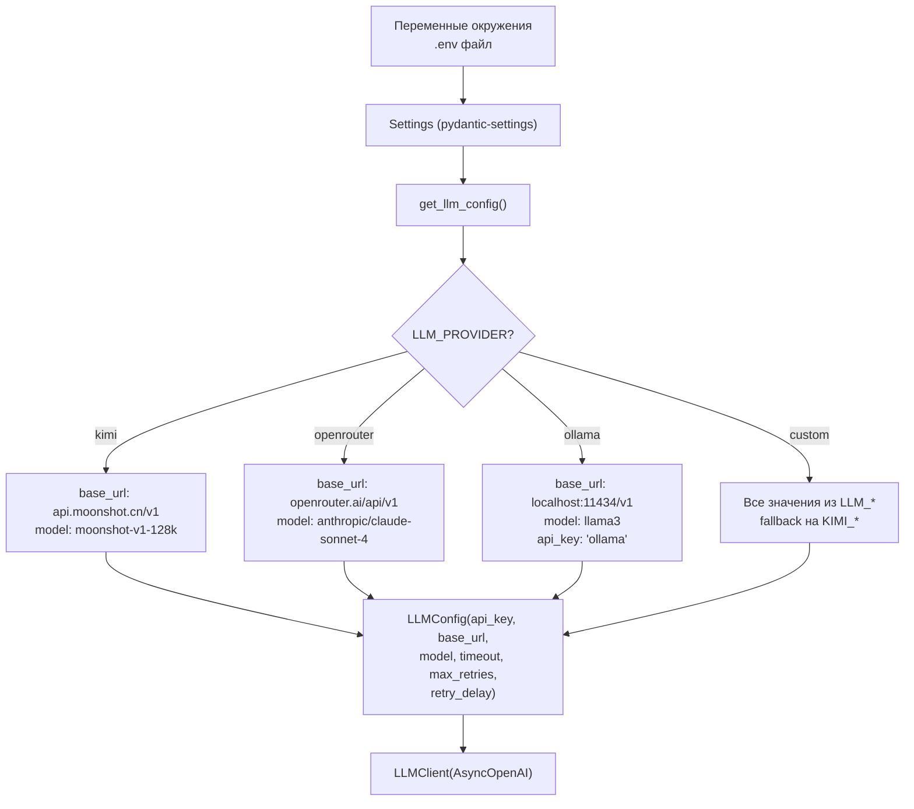

### 7.2 Переменные окружения (MLOps)

| Переменная | По умолчанию | Описание |
|-----------|-------------|----------|
| `LLM_PROVIDER` | `kimi` | Пресет провайдера: `kimi`, `openrouter`, `ollama`, `custom` |
| `LLM_API_KEY` | `""` | API-ключ (приоритет над пресетом и KIMI_API_KEY) |
| `LLM_BASE_URL` | `""` | URL API (приоритет над пресетом) |
| `LLM_MODEL` | `""` | Модель (приоритет над пресетом) |
| `LLM_TIMEOUT` | `120.0` | Таймаут запроса в секундах |
| `LLM_MAX_RETRIES` | `3` | Количество повторных попыток |
| `LLM_RETRY_DELAY` | `1.0` | Базовая задержка для экспоненциального backoff |
| `KIMI_API_KEY` | `""` | Legacy: API-ключ Moonshot (fallback) |
| `KIMI_BASE_URL` | `https://api.moonshot.cn/v1` | Legacy: URL Moonshot |
| `KIMI_MODEL` | `moonshot-v1-128k` | Legacy: модель Moonshot |
| `ORCHESTRATION_MODE` | `plan` | `plan` -- план-выполнение, `agent` -- tool-calling |
| `ORCHESTRATION_MAX_ITERATIONS` | `0` | Лимит итераций agent loop (0 = unlimited, cap 100) |
| `RAG_EMBEDDING_MODEL` | `sentence-transformers/all-MiniLM-L6-v2` | Модель эмбеддингов |
| `RAG_EMBEDDING_DIMENSION` | `384` | Размерность вектора |
| `MOCK_MODE` | `false` | Режим без реального LLM и эмбеддингов |

### 7.3 Приоритет разрешения конфигурации

Для каждого поля (api_key, base_url, model):

1. Явное значение `LLM_*` (если непустое)
2. Значение из пресета провайдера
3. Legacy значение `KIMI_*` (обратная совместимость)

### 7.4 Пресеты провайдеров

| Провайдер | Base URL | Модель по умолчанию | API Key |
|-----------|----------|-------------------|---------|
| `kimi` | `https://api.moonshot.cn/v1` | `moonshot-v1-128k` | Из `LLM_API_KEY` или `KIMI_API_KEY` |
| `openrouter` | `https://openrouter.ai/api/v1` | `anthropic/claude-sonnet-4` | Из `LLM_API_KEY` или `KIMI_API_KEY` |
| `ollama` | `http://localhost:11434/v1` | `llama3` | `"ollama"` (заглушка) |
| `custom` | Из `LLM_BASE_URL` или `KIMI_BASE_URL` | Из `LLM_MODEL` или `KIMI_MODEL` | Из `LLM_API_KEY` или `KIMI_API_KEY` |

### 7.5 Поддержка thinking-моделей

Thinking-модели (Kimi K2.5, DeepSeek R1 и др.) помещают ответ в поле `reasoning`
объекта `message`, оставляя `content` пустым. `LLMClient.chat()` обрабатывает
это через каскад эвристик:

```
1. Поиск JSON-массива с "step"/"action" (для planner)
2. Поиск JSON-объекта с кавычечными ключами (для executor)
3. Извлечение последней закавыченной строки (для translate)
4. Последняя короткая строка (fallback)
```

Для `_chat_for_json` используется увеличенный `max_tokens=8192` (вместо 4096),
чтобы вместить и reasoning, и ответ.

---

## 8. Docker архитектура

### 8.1 Сервисы и зависимости

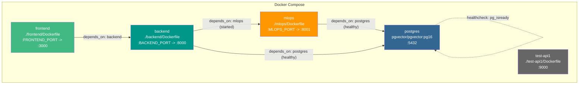

### 8.2 Порядок запуска

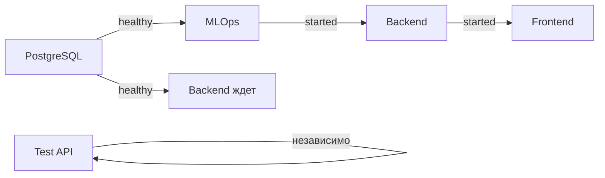

1. **PostgreSQL** стартует первым, healthcheck через `pg_isready` каждые 5 секунд
2. **MLOps** стартует после healthy PostgreSQL
3. **Backend** стартует после healthy PostgreSQL И started MLOps
4. **Frontend** стартует после started Backend
5. **Test API** стартует независимо

### 8.3 Тома (Volumes)

| Том | Назначение | Монтирование |
|-----|-----------|-------------|
| `pgdata` | Персистентные данные PostgreSQL | `/var/lib/postgresql/data` |
| `hf_cache` | Кэш моделей HuggingFace (sentence-transformers) | `/app/.cache` в mlops |
| `./backend` | Код backend (dev mount) | `/app` в backend |
| `./mlops` | Код mlops (dev mount) | `/app` в mlops |
| `./frontend` | Код frontend (dev mount) | `/app` в frontend |

### 8.4 Сетевые настройки

MLOps-сервис имеет специальные сетевые настройки:
- **DNS**: `8.8.8.8`, `8.8.4.4` (Google DNS -- для доступа к внешним API из Docker)
- **Extra hosts**: `host.docker.internal:host-gateway` (для доступа к сервисам на хосте, например Ollama)

### 8.5 Переменные окружения

Все сервисы получают переменные из файла `.env` (`env_file: .env`).
Ключевые переменные:

```env
# PostgreSQL
POSTGRES_USER=postgres
POSTGRES_PASSWORD=postgres
POSTGRES_DB=prod_copilot

# Порты
BACKEND_PORT=8000
MLOPS_PORT=8001
FRONTEND_PORT=3000

# LLM
LLM_PROVIDER=kimi
LLM_API_KEY=sk-...
LLM_MODEL=moonshot-v1-128k

# Режим
MOCK_MODE=false
ORCHESTRATION_MODE=plan
```

---

## 9. API Reference (краткий)

### 9.1 Backend API (порт 8000)

| Метод | Путь | Описание | Тело/Параметры |
|-------|------|----------|---------------|
| GET | `/health` | Health check | -- |
| POST | `/api/query` | Синхронная оркестрация | `{query, swagger_source_ids?}` |
| WS | `/api/ws/query` | Потоковая оркестрация | `{query, swagger_source_ids?, history?}` |
| POST | `/api/swagger/upload` | Загрузка Swagger-спецификации | `file` (multipart) или `url` (form) |
| GET | `/api/swagger/list` | Список источников | -- |
| GET | `/api/swagger/{id}/endpoints` | Эндпоинты источника | -- |
| GET | `/api/swagger/{id}/stats` | Статистика источника | -- |
| DELETE | `/api/swagger/{id}` | Удаление источника | -- |
| GET | `/api/endpoints/list` | Список эндпоинтов с фильтрами | `swagger_source_id?, method?, path_contains?, search?, tag?, has_parameters?, has_request_body?` |
| GET | `/api/endpoints/stats` | Общая статистика | -- |
| GET | `/api/endpoints/methods` | Уникальные HTTP-методы | -- |
| GET | `/api/endpoints/paths` | Все пути | `swagger_source_id?` |
| GET | `/api/endpoints/search` | Семантический поиск | `q, limit?` |
| GET | `/api/endpoints/{id}` | Детали эндпоинта | -- |
| GET | `/api/sandbox/files/{session_id}/{filename}` | Прокси sandbox-файлов из MLOps | -- |

### 9.2 MLOps API (порт 8001)

| Метод | Путь | Описание | Тело |
|-------|------|----------|------|
| GET | `/health` | Health check | -- |
| POST | `/api/embeddings` | Генерация эмбеддингов | `{texts: string[]}` |
| POST | `/api/rag/index` | Индексация эндпоинтов в pgvector | `{swagger_source_id, endpoints}` |
| POST | `/api/rag/search` | Семантический поиск | `{query, swagger_source_ids?, limit?}` |
| POST | `/api/translate` | Перевод запроса на английский | `{query}` |
| POST | `/api/orchestrate` | Синхронная оркестрация | `{query, endpoints, context?}` |
| POST | `/api/orchestrate/stream` | Потоковая оркестрация (SSE) | `{query, endpoints, context?}` |
| GET | `/api/sandbox/files/{session_id}/{filename}` | Файлы из code sandbox | -- |

### 9.3 SSE-события оркестрации

| Событие | Данные | Когда |
|---------|--------|-------|
| `plan` | `{steps: [...], total: N}` | После создания плана |
| `step_start` | `{step: N, action: "...", description: "..."}` | Перед выполнением шага |
| `step_complete` | `{step: N, action: "...", description: "...", result: {...}}` | После успешного выполнения |
| `step_error` | `{step: N, action: "...", error: "...", result: {...}}` | При ошибке шага |
| `result` | `{type: "...", data: {...}, metadata: {...}}` | Финальный результат |
| `error` | `{error: "..."}` | Критическая ошибка |

### 9.4 WebSocket-протокол

**Клиент -> Сервер:**
```json
{
    "query": "Покажи всех пользователей",
    "swagger_source_ids": [1, 2],
    "history": [
        {"role": "user", "content": "..."},
        {"role": "assistant", "content": "..."}
    ]
}
```

**Сервер -> Клиент:**
```json
{"type": "step", "data": {"step": 1, "action": "search", "description": "...", "status": "completed", "result": {"count": 15}}}
{"type": "step", "data": {"step": 2, "action": "api_call", "description": "...", "status": "running"}}
{"type": "step", "data": {"step": 2, "action": "api_call", "description": "...", "status": "completed", "result": {...}}}
{"type": "result", "data": {"type": "table", "data": {"columns": [...], "rows": [...]}, "metadata": {...}}}
{"type": "done", "data": {}}
```

---

## Приложение A: Архитектурные решения

### Почему pgvector, а не отдельная векторная БД?

- Нет необходимости в отдельной инфраструктуре (Pinecone, Weaviate, Milvus)
- Метаданные эндпоинтов и эмбеддинги в одной транзакции
- Каскадное удаление: удаление SwaggerSource удаляет все эндпоинты и эмбеддинги
- HNSW-индекс обеспечивает достаточную производительность для масштаба проекта

### Почему SSE между Backend и MLOps, а не WebSocket?

- SSE -- однонаправленный стриминг (сервер -> клиент), что точно соответствует сценарию
- Встроенная поддержка в FastAPI через `sse-starlette`
- Простая семантика переподключения
- WebSocket используется только между Frontend и Backend, где нужен двунаправленный канал

### Почему subprocess для sandbox, а не Docker-in-Docker?

- Минимальная задержка на запуск (нет overhead создания контейнера)
- Достаточная изоляция для генерации графиков и обработки данных
- Файлы отдаются через `FileResponse` с валидацией UUID сессии и имени файла

### Два режима оркестрации (plan vs agent)

- **Plan**: предсказуемый, отлаживаемый, визуализируемый через UI (шаги с прогрессом)
- **Agent**: гибкий, может адаптироваться к неожиданным ответам API, не требует заранее спланированного потока

---

## Приложение B: Диаграмма полной обработки Swagger-спецификации

```mermaid
flowchart TD
    UPLOAD["POST /api/swagger/upload<br/>(file или URL)"] --> FETCH{Источник?}
    FETCH -->|Файл| READ_FILE["Чтение bytes -> decode UTF-8"]
    FETCH -->|URL| FETCH_URL["httpx.get(url, timeout=30)"]
    READ_FILE --> PARSE_FORMAT{Формат?}
    FETCH_URL --> PARSE_FORMAT

    PARSE_FORMAT -->|JSON| JSON_PARSE["json.loads()"]
    PARSE_FORMAT -->|YAML| YAML_PARSE["yaml.safe_load()"]

    JSON_PARSE --> SPEC_DICT["spec_dict"]
    YAML_PARSE --> SPEC_DICT

    SPEC_DICT --> PARSER["SwaggerParser.parse()"]
    PARSER --> DETECT{Версия?}
    DETECT -->|"swagger: 2.0"| SW2["_parse_swagger2()"]
    DETECT -->|"openapi: 3.x"| OA3["_parse_openapi3()"]

    SW2 --> ENDPOINTS["list[ParsedEndpoint]"]
    OA3 --> ENDPOINTS

    SPEC_DICT --> BASE_URL["SwaggerParser.extract_base_url()"]

    ENDPOINTS --> SAVE_SOURCE["Сохранение SwaggerSource в БД"]
    BASE_URL --> SAVE_SOURCE

    SAVE_SOURCE --> INDEX["RAGService.index_endpoints()"]

    INDEX --> EMB_LOOP["Для каждого эндпоинта:"]
    EMB_LOOP --> BUILD_TEXT["Формирование текста:<br/>method + path + summary + description + params"]
    BUILD_TEXT --> GET_EMB["MLOps: POST /api/embeddings<br/>(sentence-transformers)"]
    GET_EMB --> SAVE_EP["Сохранение ApiEndpoint<br/>с embedding Vector(384)"]

    SAVE_EP --> RESPONSE["SwaggerUploadResponse:<br/>id, name, base_url, endpoints_count"]
```

