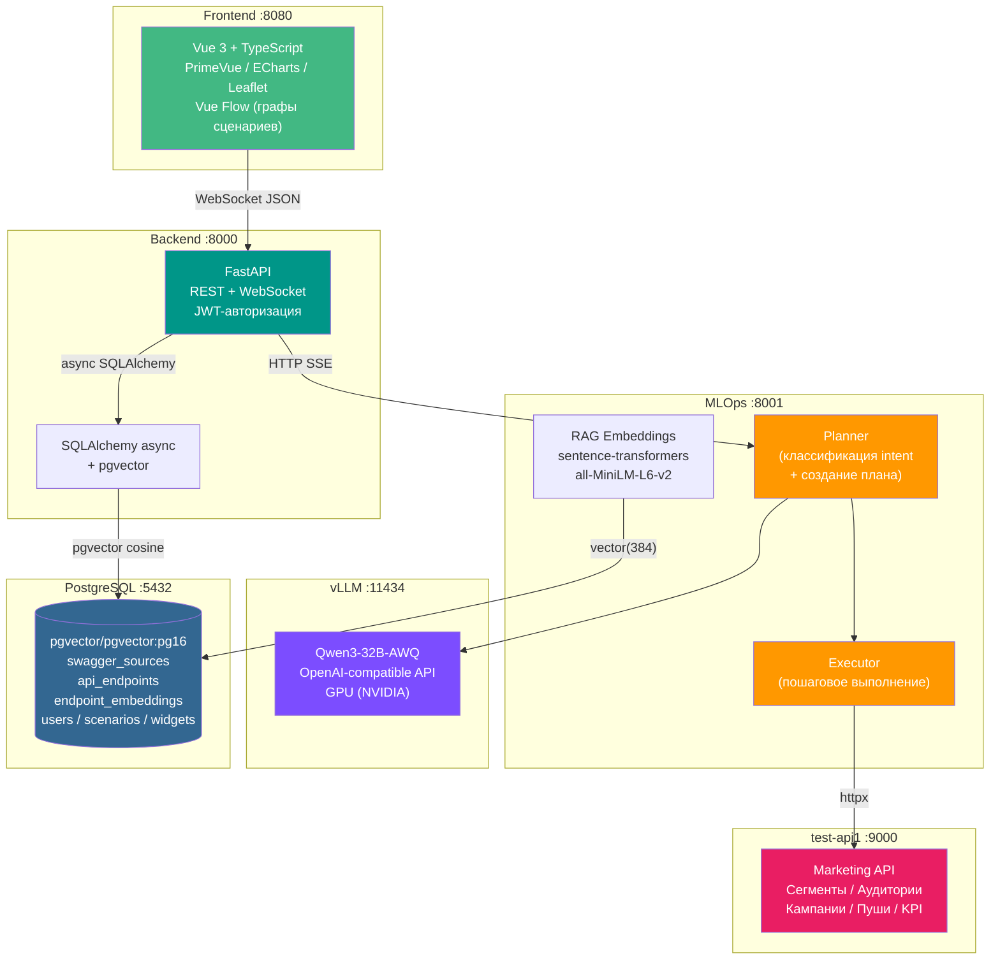
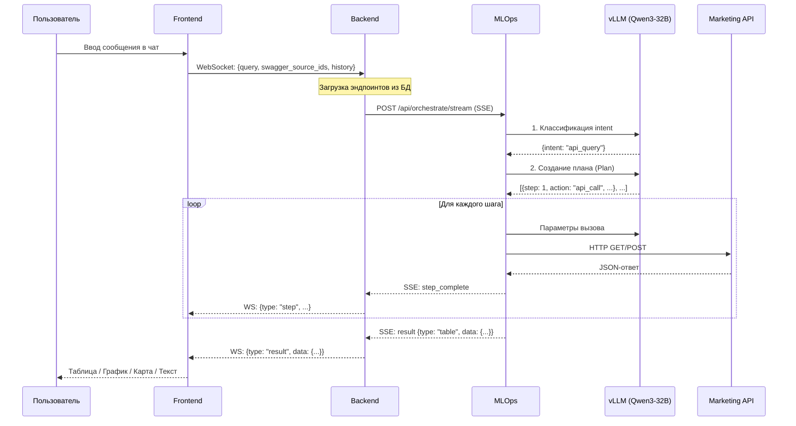
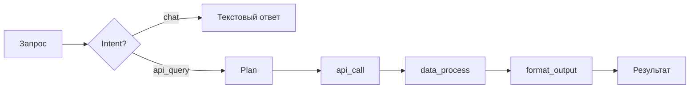
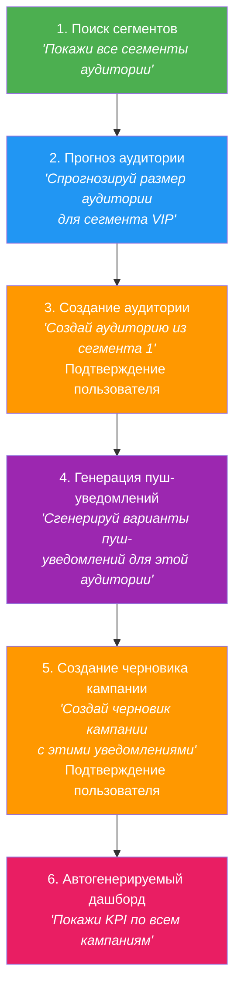

# Prod Copilot -- Универсальный инструмент оркестрации API

> AI-копилот, который загружает Swagger/OpenAPI спецификации, индексирует эндпоинты
> с помощью векторных эмбеддингов (RAG), и выполняет произвольные запросы на естественном
> языке через многошаговый LLM-оркестратор с потоковым выводом.

---

## Содержание

1. [Архитектура](#архитектура)
2. [Технологический стек](#технологический-стек)
3. [Быстрый старт](#быстрый-старт)
4. [Возможности](#возможности)
5. [Демо: маркетинговый сценарий](#демо-маркетинговый-сценарий)
6. [API-документация](#api-документация)
7. [Переменные окружения](#переменные-окружения)
8. [Тестирование](#тестирование)
9. [Оценка качества (Evaluation)](#оценка-качества-evaluation)
10. [Структура проекта](#структура-проекта)

---

## Архитектура

Система состоит из шести компонентов, развернутых через Docker Compose. Frontend
общается с Backend по WebSocket, Backend стримит данные из MLOps через SSE
(Server-Sent Events), MLOps обращается к LLM через vLLM (Qwen3-32B-AWQ), а к
внешним API -- по HTTP. Все метаданные и векторные эмбеддинги хранятся в PostgreSQL
с расширением pgvector.



### Поток обработки запроса



### Протоколы взаимодействия

| Связь | Протокол | Описание |
|-------|----------|----------|
| Frontend --> Backend | **WebSocket** | Двунаправленный канал, стриминг шагов и результатов |
| Backend --> MLOps | **HTTP + SSE** | `POST /api/orchestrate/stream`, события: plan, step_start, step_complete, result |
| Backend --> PostgreSQL | **asyncpg** | Асинхронные запросы через SQLAlchemy 2.0 |
| MLOps --> vLLM | **OpenAI API** | Chat Completions через `openai.AsyncOpenAI` |
| MLOps --> External APIs | **httpx** | Выполнение API-вызовов по плану из LLM |

---

## Технологический стек

### Frontend
| Технология | Назначение |
|-----------|-----------|
| **Vue 3** + TypeScript | SPA-фреймворк |
| **Vite** | Сборщик |
| **PrimeVue 4** | UI-компоненты |
| **ECharts** (vue-echarts) | Графики и диаграммы |
| **Leaflet** (vue-leaflet) | Карты |
| **Vue Flow** | Визуальные графы сценариев |
| **Pinia** | Управление состоянием |
| **Axios** | HTTP-клиент |
| **Marked** | Рендеринг Markdown |

### Backend
| Технология | Назначение |
|-----------|-----------|
| **FastAPI** | Web-фреймворк (REST + WebSocket) |
| **SQLAlchemy 2.0** (async) | ORM |
| **asyncpg** | PostgreSQL-драйвер |
| **pgvector** | Векторные эмбеддинги |
| **python-jose** + **passlib** | JWT-авторизация (bcrypt) |
| **httpx** | Асинхронный HTTP-клиент |
| **PyYAML** | Парсинг Swagger-спецификаций |
| **Pydantic 2** + pydantic-settings | Валидация и конфигурация |

### MLOps
| Технология | Назначение |
|-----------|-----------|
| **FastAPI** | Web-фреймворк + SSE |
| **openai** (AsyncOpenAI) | Клиент к LLM (OpenAI-compatible API) |
| **sentence-transformers** | RAG-эмбеддинги (all-MiniLM-L6-v2, 384d) |
| **pandas** / **numpy** | Обработка данных |
| **matplotlib** / **plotly** | Генерация графиков |
| **tenacity** | Retry-логика для LLM-вызовов |
| **sse-starlette** | Server-Sent Events |

### Инфраструктура
| Технология | Назначение |
|-----------|-----------|
| **Docker Compose** | Оркестрация контейнеров (6 сервисов) |
| **PostgreSQL 16** + **pgvector** | СУБД + векторный поиск |
| **vLLM** | Inference-сервер для LLM (GPU) |
| **Qwen3-32B-AWQ** | Языковая модель (квантизация AWQ) |

---

## Быстрый старт

### Предварительные требования

- Docker и Docker Compose
- NVIDIA GPU с поддержкой CUDA (для vLLM)
- ~20 ГБ дискового пространства (веса модели)

### Запуск

```bash
# 1. Клонировать репозиторий
git clone <repo-url> prod-copilot
cd prod-copilot

# 2. Создать файл конфигурации
cp .env.example .env
# Отредактировать .env -- задать пароли и параметры LLM

# 3. Запустить все сервисы одной командой
docker compose up -d
```

После запуска:

| Сервис | URL |
|--------|-----|
| Frontend (UI) | http://localhost:8080 |
| Backend API | http://localhost:8000 |
| MLOps API | http://localhost:8001 |
| Marketing API (демо) | http://localhost:9000 |
| vLLM | http://localhost:11434 |
| PostgreSQL | localhost:5432 |

> **Примечание**: vLLM загружает модель при первом запуске -- это может занять
> 5-10 минут. Health-check настроен с `start_period: 600s`.

---

## Возможности

### Чат с потоковым выводом (token-by-token)

Пользователь вводит запрос на естественном языке, система стримит ответ пошагово
через WebSocket. Каждый шаг плана отображается в реальном времени: поиск эндпоинтов,
вызов API, обработка данных, форматирование результата.

### RAG-поиск эндпоинтов

Загруженные Swagger/OpenAPI спецификации автоматически индексируются через
sentence-transformers (all-MiniLM-L6-v2). При поступлении запроса система находит
релевантные эндпоинты по косинусному расстоянию (pgvector) и передает их в LLM
для составления плана.

### Многошаговая оркестрация (Plan --> Execute --> Format)



LLM создает план из нескольких шагов, каждый из которых может быть:
- **api_call** -- HTTP-вызов к внешнему API
- **data_process** -- обработка данных через pandas (filter, sort, merge, aggregate)
- **execute_code** -- выполнение Python-кода в sandbox
- **format_output** -- автоопределение типа вывода и форматирование

### Подтверждение мутирующих действий

Любое изменяющее действие (POST / PUT / DELETE / PATCH) требует явного подтверждения
от пользователя. Система показывает, какой endpoint будет вызван и с какими
параметрами, и ожидает подтверждения перед выполнением. Поддержка ролей: только
оператор или администратор может подтвердить действие.

### История чатов с поиском

Все диалоги сохраняются в базе данных. Пользователь может просматривать историю,
искать по содержимому, и продолжать ранее начатые разговоры. Последние 6 сообщений
из истории передаются в LLM для поддержания контекста.

### Сценарии с визуальными графами выполнения

Каждый запрос фиксируется как сценарий (ScenarioRun) с пошаговой историей
(ScenarioStep). Frontend отображает граф выполнения через Vue Flow -- узлы
представляют шаги (api_call, data_process, format_output), ребра -- зависимости.

### Дашборд с KPI и графиками

Автогенерируемые виджеты (WidgetConfig) на основе данных API:
- **KPI-карточки** -- ключевые метрики
- **Графики** (ECharts) -- линейные, столбчатые, круговые
- **Таблицы** -- табличное представление данных
- **Карточки** -- компактные информационные блоки
- **Timeline** -- хронология событий

### Авторизация (JWT) с ролями

Система поддерживает регистрацию и авторизацию через JWT-токены (bcrypt для хеширования
паролей). Ролевая модель с разделением доступа -- мутирующие операции требуют
соответствующих прав.

### Множественные типы вывода

| Тип | Описание |
|-----|----------|
| `text` | Текстовый ответ (Markdown) |
| `table` | Таблица с колонками и строками |
| `chart` | График (ECharts конфигурация) |
| `list` | Список элементов |
| `map` | Карта (Leaflet маркеры/полигоны) |
| `image` | Сгенерированное изображение |
| `dashboard` | Набор виджетов (KPI + графики + таблицы) |

---

## Демо: маркетинговый сценарий

В комплекте поставляется **test-api1** -- Marketing Automation API (FastAPI + SQLite),
имитирующий реальный маркетинговый сервис с сегментами, аудиториями, кампаниями,
пуш-уведомлениями и аналитикой.

### Полный сценарий демонстрации



#### Шаг 1: Поиск сегментов

Пользователь: *"Покажи все сегменты аудитории"*

Система выполняет `GET /api/segments` и возвращает таблицу сегментов с названиями,
описаниями и критериями фильтрации.

#### Шаг 2: Прогноз аудитории

Пользователь: *"Спрогнозируй размер аудитории для сегмента VIP"*

Система вызывает `GET /api/analytics/audience-forecast` с параметрами сегмента
и отображает прогноз в виде графика.

#### Шаг 3: Создание аудитории (с подтверждением)

Пользователь: *"Создай аудиторию из сегмента 1"*

Система обнаруживает мутирующую операцию (`POST /api/audiences`) и запрашивает
подтверждение. После подтверждения создает аудиторию и возвращает результат.

#### Шаг 4: Генерация пуш-уведомлений

Пользователь: *"Сгенерируй варианты пуш-уведомлений для этой аудитории"*

Система вызывает `POST /api/push/generate` и возвращает несколько вариантов
текстов уведомлений.

#### Шаг 5: Создание черновика кампании (с подтверждением)

Пользователь: *"Создай черновик кампании с этими уведомлениями"*

Снова мутирующая операция (`POST /api/campaigns`) -- запрос подтверждения,
затем создание кампании.

#### Шаг 6: Автогенерируемый дашборд

Пользователь: *"Покажи KPI по всем кампаниям"*

Система собирает данные из нескольких эндпоинтов (`/api/analytics/kpi`,
`/api/campaigns`) и формирует дашборд с KPI-карточками и графиками.

---

## API-документация

### Backend API (порт 8000)

#### Авторизация

| Endpoint | Метод | Описание |
|----------|-------|----------|
| `/api/auth/register` | POST | Регистрация нового пользователя |
| `/api/auth/login` | POST | Авторизация, получение JWT-токена |

#### Swagger-спецификации

| Endpoint | Метод | Описание |
|----------|-------|----------|
| `/api/swagger/upload` | POST | Загрузка спецификации (файл JSON/YAML или URL) |
| `/api/swagger/list` | GET | Список всех загруженных источников |
| `/api/swagger/{id}/endpoints` | GET | Эндпоинты конкретного источника |
| `/api/swagger/{id}/stats` | GET | Статистика по методам |
| `/api/swagger/{id}` | DELETE | Удаление источника (каскадное) |

#### Эндпоинты

| Endpoint | Метод | Описание |
|----------|-------|----------|
| `/api/endpoints/list` | GET | Список с фильтрацией (source, method, path, tag) |
| `/api/endpoints/stats` | GET | Общая статистика |
| `/api/endpoints/search` | GET | Семантический поиск (pgvector cosine) |
| `/api/endpoints/{id}` | GET | Детали одного эндпоинта |

#### Запросы и оркестрация

| Endpoint | Метод | Описание |
|----------|-------|----------|
| `/api/query` | POST | Синхронная оркестрация |
| `/api/ws/query` | WebSocket | Потоковая оркестрация с пошаговыми обновлениями |

#### Подтверждения

| Endpoint | Метод | Описание |
|----------|-------|----------|
| `/api/confirmations` | GET | Список ожидающих подтверждения действий |
| `/api/confirmations` | POST | Создание запроса на подтверждение |
| `/api/confirmations/{id}/approve` | POST | Подтверждение действия |
| `/api/confirmations/{id}/reject` | POST | Отклонение действия |

#### Сценарии

| Endpoint | Метод | Описание |
|----------|-------|----------|
| `/api/scenarios` | GET | Список сценариев с пагинацией |
| `/api/scenarios` | POST | Создание нового сценария |
| `/api/scenarios/{id}` | GET | Детали сценария с графом выполнения |

#### Виджеты и дашборд

| Endpoint | Метод | Описание |
|----------|-------|----------|
| `/api/widgets` | GET | Список виджетов |
| `/api/widgets` | POST | Создание виджета (kpi, chart, table, card, timeline, list) |
| `/api/widgets/{id}` | GET | Получение виджета |
| `/api/widgets/{id}` | DELETE | Удаление виджета |

#### История

| Endpoint | Метод | Описание |
|----------|-------|----------|
| `/api/history` | GET | История чатов с поиском |

### MLOps API (порт 8001)

| Endpoint | Метод | Описание |
|----------|-------|----------|
| `/api/orchestrate` | POST | Синхронная оркестрация |
| `/api/orchestrate/stream` | POST | Потоковая оркестрация (SSE) |
| `/api/translate` | POST | Перевод запроса на английский |
| `/api/embeddings` | POST | Генерация эмбеддингов |
| `/api/index` | POST | Индексация эндпоинтов в pgvector |
| `/api/search` | POST | Семантический поиск по эндпоинтам |
| `/health` | GET | Health-check |

### Marketing API -- test-api1 (порт 9000)

| Endpoint | Метод | Описание |
|----------|-------|----------|
| `/api/segments` | GET/POST | Сегменты аудитории |
| `/api/segments/search` | GET | Поиск сегментов |
| `/api/segments/{id}/audience` | GET | Оценка размера аудитории |
| `/api/audiences` | GET/POST | Аудитории |
| `/api/audiences/{id}/overlap` | GET | Пересечение аудиторий |
| `/api/campaigns` | GET/POST | Кампании |
| `/api/campaigns/{id}` | GET/PATCH | Детали/обновление кампании |
| `/api/push/generate` | POST | Генерация пуш-уведомлений |
| `/api/push/templates` | GET | Шаблоны уведомлений |
| `/api/analytics/kpi` | GET | Маркетинговые KPI |
| `/api/analytics/audience-forecast` | GET | Прогноз аудитории |
| `/api/analytics/campaign/{id}/performance` | GET | Эффективность кампании |
| `/api/users` | GET | Пользователи с фильтрацией |
| `/api/users/stats` | GET | Статистика по пользователям |

---

## Переменные окружения

Файл `.env.example` содержит все необходимые переменные:

| Переменная | Описание | Значение по умолчанию |
|-----------|----------|----------------------|
| `POSTGRES_USER` | Пользователь PostgreSQL | `copilot` |
| `POSTGRES_PASSWORD` | Пароль PostgreSQL | -- (обязательно) |
| `POSTGRES_DB` | Имя базы данных | `copilot_db` |
| `POSTGRES_HOST` | Хост PostgreSQL | `postgres` |
| `POSTGRES_PORT` | Порт PostgreSQL | `5432` |
| `MOCK_MODE` | Режим без реального LLM | `false` |
| `LLM_PROVIDER` | Провайдер LLM | -- |
| `LLM_API_KEY` | API-ключ LLM | -- |
| `LLM_BASE_URL` | Базовый URL LLM API | -- |
| `LLM_MODEL` | Модель LLM | `Qwen/Qwen3-32B-AWQ` |
| `BACKEND_PORT` | Порт backend | `8000` |
| `MLOPS_PORT` | Порт MLOps | `8001` |
| `RAG_EMBEDDING_MODEL` | Модель эмбеддингов | `sentence-transformers/all-MiniLM-L6-v2` |
| `HF_CACHE_DIR` | Кеш Hugging Face | `~/.cache/huggingface` |
| `VLLM_CACHE_DIR` | Кеш vLLM | `~/.cache/vllm` |

---

## Тестирование

Проект содержит **704 теста** (572 backend + 132 MLOps), покрывающих все основные модули.

### Запуск тестов

```bash
# Backend тесты (572 теста)
docker compose exec backend pytest tests/ -v

# MLOps тесты (132 теста)
docker compose exec mlops pytest tests/ -v

# Все тесты
docker compose exec backend pytest tests/ -v && \
docker compose exec mlops pytest tests/ -v
```

### Покрытие тестами

| Модуль | Тесты | Что покрыто |
|--------|-------|------------|
| backend/tests/test_auth.py | 15 | JWT-авторизация, регистрация, ролевой доступ |
| backend/tests/test_swagger_parser.py | 28 | Парсинг OpenAPI 3.x и Swagger 2.0 |
| backend/tests/test_scenarios.py | 45 | Сценарии, графы выполнения |
| backend/tests/test_widgets.py | 121 | Виджеты дашборда (все типы) |
| backend/tests/test_relations.py | 43 | Связи между эндпоинтами |
| backend/tests/test_negative_e2e.py | 59 | Негативные сценарии, edge cases |
| mlops/tests/test_executor.py | 30 | Пошаговое выполнение плана |
| mlops/tests/test_planner.py | 12 | Классификация intent, планирование |
| mlops/tests/test_embeddings.py | 16 | RAG-эмбеддинги |
| mlops/tests/test_data_processor.py | 18 | Pandas-обработка данных |

---

## Оценка качества (Evaluation)

В директории `mlops/eval/` находится система оценки качества оркестрации:

- **dataset.json** -- 25 тестовых кейсов с ожидаемыми intent, шагами, эндпоинтами и типами результатов
- **run_eval.py** -- скрипт оценки с двумя режимами
- **results.json** -- результаты последнего запуска

### Запуск оценки

```bash
# Mock-режим (без LLM, детерминированные эвристики, подходит для CI)
cd mlops/eval
python run_eval.py --mock

# Live-режим (вызывает работающий MLOps-сервис)
python run_eval.py --live --url http://localhost:8001
```

### Метрики

| Метрика | Описание |
|---------|----------|
| Intent accuracy | Точность классификации intent (chat / api_query) |
| Step match rate | Совпадение плана с ожидаемыми шагами |
| Result type accuracy | Правильность типа вывода (table, chart, text, ...) |
| Overall pass rate | Процент кейсов, прошедших все три проверки |

Результаты разбиваются по уровню сложности (easy / medium / hard) и тегам
(greeting, segments, campaigns и др.).

---

## Структура проекта

```
prod-copilot/
├── docker-compose.yml          # Оркестрация 6 сервисов
├── .env.example                # Шаблон переменных окружения
├── ARCHITECTURE.md             # Детальная архитектурная документация
│
├── frontend/                   # Vue 3 + TypeScript + PrimeVue
│   ├── src/
│   │   ├── views/              # ChatView, DashboardView, ScenariosView, ...
│   │   ├── composables/        # useAuth, useChat, ...
│   │   └── router/             # Vue Router с JWT-гардами
│   └── package.json
│
├── backend/                    # FastAPI :8000
│   ├── app/
│   │   ├── api/                # router.py, query.py, swagger.py, endpoints.py,
│   │   │                       # auth.py, scenarios.py, widgets.py, confirmations.py,
│   │   │                       # relations.py, history.py, dashboard_data.py
│   │   ├── services/           # mlops_client.py, rag_service.py, swagger_parser.py
│   │   ├── db/                 # models.py, session.py (SQLAlchemy async)
│   │   └── schemas/            # Pydantic-модели
│   ├── tests/                  # 572 теста
│   └── requirements.txt
│
├── mlops/                      # FastAPI :8001
│   ├── app/
│   │   ├── llm/                # kimi_client.py, prompts.py, mock_client.py
│   │   ├── orchestrator/       # planner.py, executor.py, agent_loop.py
│   │   ├── mcp/                # api_executor.py, data_processor.py, code_sandbox.py
│   │   ├── rag/                # embeddings.py, search.py
│   │   └── schemas/            # Pydantic-модели
│   ├── eval/                   # Система оценки качества (25 кейсов)
│   ├── tests/                  # 132 теста
│   └── requirements.txt
│
└── test-api1/                  # Marketing API (демо) :9000
    ├── app.py                  # FastAPI + SQLite
    ├── seed.py                 # Генерация тестовых данных
    └── marketing.db            # SQLite база с маркетинговыми данными
```
